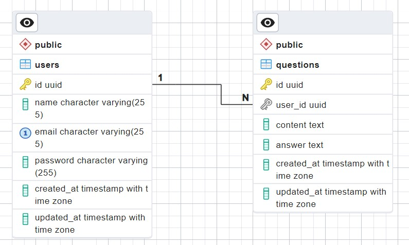
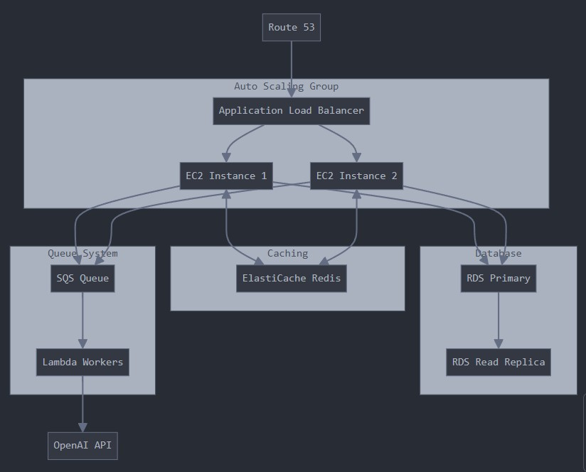

# AnswersAi

### Tech Stack
- Node.js
- Express.js
- Postgres
- Sequelize ORM
- Docker

### How to setup and run the project
1. Clone the repo & update the `.env` file

   ```bash
   git clone https://github.com/rohit1kumar/Rohit-Kumar-AnswersAi-Backend.git
   cd Rohit-Kumar-AnswersAi-Backend
   cp .env.example .env
   ```

2. (Optional) Use Docker:

   ```bash
   docker-compose up --build
   ```

3. (if not using Docker) Install dependencies & run:

   ```bash
   npm install
   npm run dev
   ```

4. The server should be running on `http://localhost:8000`
5. Test health check:

   ```bash
   curl http://localhost:8000/healthz
   ```
### API Documentation
Import the Postman Collection from [docs](./docs/postman_collection.json)

### Database Schema


### Infra Diagram

*note: Generated by Claude*
